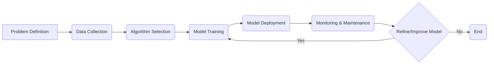

## Artificial Intelligence (AI) 🧠 - In 5 Minutes

### 🧠 What
*   **Simulating Human Intelligence:** AI is a broad field that aims to create systems capable of performing tasks that typically require human intelligence.
*   **Cognitive Abilities:** Involves mimicking cognitive functions like learning, problem-solving, decision-making, and perception.
*   **Intelligent Agents:** Develops intelligent agents or systems that can perceive their environment and act to achieve goals.
*   **Data-Driven:** Often relies on large datasets and algorithms to enable learning and automation.
*   **Multidisciplinary:** It is a highly multidisciplinary field that involves computer science, mathematics, statistics, psychology, and neuroscience.

### 🎯 Why
*   **Automation and Efficiency:** Automates complex tasks, leading to increased efficiency, accuracy, and productivity.
*   **Problem Solving:** Solves problems that are too complex for humans, such as large-scale data analysis and optimization.
*   **Innovation:** Drives innovation across various industries, including healthcare, finance, transportation, and manufacturing.
*   **Improved Decision Making:** Provides insights and predictions to support better decision-making processes.
*   **Enhanced User Experience:** Powers intelligent applications and devices that offer personalized and seamless user experiences.

### ⚙️ Where Applied
*   **Healthcare:** AI-powered diagnostic tools, drug discovery, and personalized treatment plans.
*   **Finance:** Algorithmic trading, fraud detection, and risk management.
*   **Transportation:** Autonomous vehicles, traffic management systems, and logistics optimization.
*  **Retail:** Personalized shopping experiences, demand forecasting, and inventory management.
*  **Manufacturing:** Predictive maintenance, quality control, and robotic automation.

### 🧠 How it Works
*   **Data Gathering:** Collecting data relevant to the task or problem.
*   **Algorithm Development:** Creating and selecting algorithms for learning and problem-solving.
*   **Model Training:** Training models using data to enable pattern recognition and decision-making.
*   **Inference/Prediction:** Applying trained models to new data for inference and prediction.
*   **Evaluation and Improvement:** Evaluating model performance and iteratively improving it.

### 🔄 Lifecycle
*   **Problem Definition:** Identifying the specific problem to be solved with AI.
*  **Data Collection:** Gathering and preprocessing the necessary data.
*   **Algorithm Selection:** Choosing the appropriate AI algorithms.
*   **Model Training:** Training the model using the collected data.
*   **Model Deployment:** Deploying the trained model in a production environment.
*   **Monitoring & Maintenance:** Continuously monitoring and improving the AI system.

### 📊 Diagram

### 🔗 Related Items
*   **Machine Learning (ML):** A subfield of AI focused on learning from data.
*   **Deep Learning:** A type of ML that uses artificial neural networks.
*   **Natural Language Processing (NLP):** Enabling computers to understand and process human language.
*   **Computer Vision:** Enabling computers to "see" and interpret images and videos.
*  **Robotics:** Creating robots capable of performing complex tasks autonomously.
