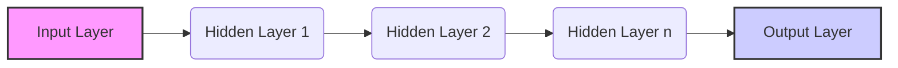

## Deep Learning 🧠 - In 5 Minutes

### 🧠 What
*   **Neural Networks with Many Layers:** Deep Learning (DL) is a subfield of machine learning that uses artificial neural networks with multiple layers (deep neural networks).
*   **Hierarchical Feature Learning:** Deep neural networks automatically learn hierarchical representations of data, where lower layers learn basic features and higher layers combine those features into more complex ones.
*   **Complex Pattern Recognition:** It's capable of learning intricate patterns in large, complex datasets.
*  **Data Intensive:** Typically requires vast amounts of training data to achieve optimal performance.
*   **End-to-End Learning:** Many DL models are trained end-to-end, meaning the entire network is optimized from input to output.

### 🎯 Why
*   **Automatic Feature Extraction:** Automatically learns relevant features from data, reducing the need for manual feature engineering.
*   **High Accuracy:** Achieves state-of-the-art results in various tasks, including image recognition, natural language processing, and speech recognition.
*   **Complex Problem Solving:** Addresses problems that traditional machine learning algorithms struggle with.
*   **Scalability:** Can scale effectively with the availability of more data and compute resources.
*   **Adaptability:** DL models can be adapted to various domains and tasks through transfer learning.

### ⚙️ Where Applied
*   **Image Recognition:** Identifying objects, faces, and scenes in images.
*   **Natural Language Processing:** Language translation, text summarization, sentiment analysis, and chatbot development.
*   **Speech Recognition:** Converting speech to text.
*   **Autonomous Driving:** Enabling self-driving cars.
*  **Drug Discovery:** Accelerating the identification of new drug candidates.

### 🧠 How it Works
*   **Input Layer:** Receives the raw input data, such as pixels of an image or words in a text.
*   **Hidden Layers:** Series of layers where neurons perform mathematical computations and learn data representations.
*   **Activation Functions:** Non-linear functions applied to the output of each neuron to introduce non-linearity in the network.
*   **Backpropagation:** The algorithm that propagates errors backward through the network to update weights and minimize loss.
*   **Output Layer:** Produces the final prediction or classification.

### 🔄 Lifecycle
*  **Data Collection:** Gather large amounts of data relevant to the task.
*   **Data Preprocessing:** Prepare data by cleaning, normalizing, and augmenting it.
*  **Model Design:** Define the architecture of the deep neural network.
*   **Model Training:** Train the model using the prepared data and optimization algorithms.
*   **Model Evaluation:** Evaluate model performance on a validation dataset.
*   **Model Tuning:** Adjust model hyperparameters for optimal performance.
*   **Model Deployment:** Deploy the trained model for inference.

### 📊 Diagram

### 🔗 Related Items
*   **Convolutional Neural Networks (CNNs):** Commonly used for image and video processing.
*   **Recurrent Neural Networks (RNNs):** Suitable for sequential data processing like text and speech.
*   **Long Short-Term Memory (LSTM):** A type of RNN that addresses the vanishing gradient problem.
*   **Generative Adversarial Networks (GANs):** Used to generate synthetic data like images and text.
*  **Transfer Learning:** Utilizing pre-trained models to solve new tasks.
