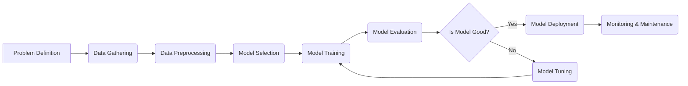

## Machine Learning 🤖 - In 5 Minutes

### 🤖 What
*   **Learning from Data:** Machine learning (ML) is a subfield of Artificial Intelligence (AI) that focuses on enabling systems to learn from data without explicit programming.
*   **Pattern Recognition:** It involves algorithms that identify patterns and relationships within data, allowing machines to make predictions or decisions.
*   **Algorithm Development:** ML includes designing and developing algorithms that can learn and improve automatically with experience.
*  **Data-Driven Decisions:** ML models make data-driven decisions or predictions, rather than relying on hard-coded rules.
*   **Iterative Process:** ML is an iterative process of model training, evaluation, and improvement based on data feedback.

### 🎯 Why
*   **Automation:** Automates tasks that would be difficult or impossible to program explicitly, such as image recognition or natural language understanding.
*   **Prediction and Insights:** Enables businesses and researchers to make data-driven decisions, identify trends, and predict future outcomes.
*   **Efficiency and Scalability:** Allows for the processing and analysis of large datasets, leading to increased efficiency and scalability.
*   **Personalization:** Powers personalized recommendations and experiences in various applications, including e-commerce and social media.
*   **Adaptability:** Allows models to adapt to new data and environments, which improves its robustness.

### ⚙️ Where Applied
*   **Recommendation Engines:** Recommending products, movies, music, etc., based on user preferences.
*   **Image Recognition:** Identifying objects, faces, and scenes in images.
*   **Natural Language Processing:** Understanding, analyzing, and generating human language.
*   **Fraud Detection:** Identifying fraudulent activities in financial transactions.
*   **Medical Diagnosis:** Assisting in medical diagnosis and treatment plans.

### 🧠 How it Works
*   **Data Collection:** Gathering relevant and sufficient data for training the model.
*  **Data Preprocessing:** Preparing data, which includes cleaning, transforming, and scaling it.
*   **Model Selection:** Choosing the right algorithm or model architecture based on the problem type.
*   **Model Training:** Training the model using labeled or unlabeled data, allowing the algorithm to learn relationships.
*   **Model Evaluation:** Evaluating model performance using test data and relevant metrics.
*  **Model Tuning:** Fine-tuning model hyperparameters to optimize for better results.

### 🔄 Lifecycle
*  **Problem Definition:** Identify the problem to solve with ML.
*  **Data Gathering:** Collect and preprocess the relevant data.
*  **Model Development:** Select and train a suitable ML model.
*  **Model Deployment:** Deploy the trained model into a production environment.
*   **Monitoring & Maintenance:** Continuously monitor model performance and re-train as needed.

### 📊 Diagram

### 🔗 Related Items
*   **Supervised Learning:** Training models using labeled data.
*   **Unsupervised Learning:** Training models using unlabeled data.
*   **Reinforcement Learning:** Training models through interactions with an environment.
*   **Deep Learning:** A subset of ML that uses neural networks with many layers.
*   **Feature Engineering:** Selecting and transforming relevant input features for ML models.
