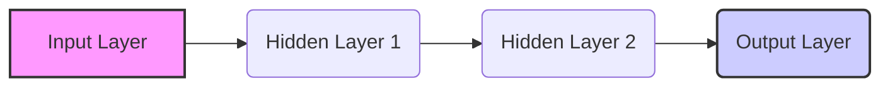

## Neural Networks 🧠 - In 5 Minutes

### 🧠 What
*   **Inspired by the Brain:** Neural networks are computational models inspired by the structure and function of biological neural networks in the brain.
*   **Interconnected Nodes:** Composed of interconnected nodes (neurons) organized in layers.
*  **Learning from Data:** Learns from data by adjusting the connections (weights) between nodes.
*   **Non-Linear Functions:** Uses non-linear activation functions to model complex relationships in data.
*   **Foundation for Deep Learning:** Forms the core of deep learning models.

### 🎯 Why
*   **Pattern Recognition:** Can learn complex patterns and relationships in data.
*   **Feature Extraction:** Automatically learns relevant features from data, reducing the need for manual feature engineering.
*   **Versatile Applications:** Can be applied to a wide variety of tasks, including image recognition, natural language processing, and time series analysis.
*   **Adaptability:** Can adapt to new data and environments, making them robust and flexible.
*  **High Accuracy:** Can achieve state-of-the-art performance in various tasks.

### ⚙️ Where Applied
*   **Image Recognition:** Identifying objects, faces, and scenes in images.
*   **Natural Language Processing (NLP):** Language translation, text summarization, and sentiment analysis.
*  **Speech Recognition:** Converting speech to text.
*   **Recommendation Systems:** Predicting user preferences for products or services.
*   **Financial Modeling:** Predicting market trends and credit risk.

### 🧠 How it Works
*   **Input Layer:** Receives the input data (features).
*   **Hidden Layers:** Layers of neurons performing mathematical operations on the input data.
*   **Activation Functions:** Non-linear functions applied to the output of each neuron to introduce non-linearity.
*   **Weights and Biases:** Adjustable parameters that determine the strength of connections between neurons.
*   **Output Layer:** Produces the final prediction or classification.
*  **Forward Propagation:** Calculates the output of the network.
*   **Backpropagation:** Adjusts weights and biases to minimize the difference between the predicted and actual outputs.

### 🔄 Lifecycle
*   **Data Collection:** Gather a relevant and labeled dataset.
*   **Preprocessing:** Prepare data by cleaning, normalizing, and transforming it.
*  **Network Architecture:** Choose the structure of the neural network, such as the number of layers and neurons.
*   **Training:** Train the network using the prepared data and optimization algorithms.
*   **Evaluation:** Evaluate network performance on a validation dataset.
*   **Parameter Tuning:** Fine-tune network parameters for optimal performance.
*  **Deployment:** Deploy the trained model for making predictions.

### 📊 Diagram

### 🔗 Related Items
*   **Deep Neural Networks:** Neural networks with multiple hidden layers.
*   **Convolutional Neural Networks (CNNs):** Used for image and video processing.
*   **Recurrent Neural Networks (RNNs):** Used for sequential data processing like text and speech.
*   **Activation Functions:** ReLU, Sigmoid, Tanh, etc.
*   **Optimization Algorithms:** Gradient Descent, Adam, etc.
