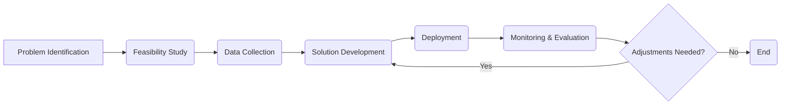

## Recognizing AI/ML Value Applications 🚀 - In 5 Minutes

### 🚀 What
*   **Transformative Potential:** AI and ML offer immense potential to transform various industries by automating tasks, improving efficiency, and unlocking new insights.
*   **Value Creation:** Identifying areas where AI/ML can deliver measurable value, including increased revenue, cost reduction, and enhanced customer satisfaction.
*   **Problem Solving:** Applying AI/ML techniques to address specific business problems and challenges.
*   **Data-Driven Decisions:** Using data-driven insights to make better decisions and optimize business operations.
*   **Innovation and Growth:** Leveraging AI/ML to drive innovation and unlock new business opportunities.

### 🎯 Why
*   **Operational Efficiency:** Automating repetitive tasks and optimizing processes to improve efficiency and reduce costs.
*   **Data-Driven Insights:** Uncovering hidden patterns, trends, and insights in data to inform decision-making.
*   **Enhanced Customer Experience:** Personalizing products and services, improving customer support, and creating more engaging experiences.
*   **Predictive Capabilities:** Using predictive models to forecast demand, anticipate risks, and optimize resource allocation.
*   **Competitive Advantage:** Developing AI/ML-powered solutions to differentiate businesses and gain a competitive edge.

### ⚙️ Where Applied
*   **Retail:** Personalized product recommendations, demand forecasting, and inventory management.
*   **Healthcare:** AI-powered diagnostic tools, personalized treatment plans, and drug discovery.
*   **Finance:** Fraud detection, risk assessment, and algorithmic trading.
*   **Manufacturing:** Predictive maintenance, quality control, and supply chain optimization.
*   **Transportation:** Autonomous vehicles, traffic management systems, and route optimization.

### 🧠 How it Works
*   **Identify Pain Points:** Analyze current processes to identify areas where AI/ML can add value.
*  **Define Objectives:** Clearly define the desired outcomes and metrics for AI/ML projects.
*  **Data Assessment:** Evaluate the availability and quality of data needed to train AI/ML models.
*  **Model Selection:** Choose appropriate AI/ML techniques based on the problem and data.
*  **Implementation:** Develop, test, and deploy AI/ML solutions.
*   **Monitor Performance:** Continuously monitor AI/ML solutions to ensure effectiveness and make adjustments.

### 🔄 Lifecycle
*   **Problem Identification:** Recognize specific business problems that AI/ML can solve.
*   **Feasibility Study:** Evaluate the feasibility and potential value of AI/ML solutions.
*   **Data Collection:** Gather the necessary data to train and evaluate models.
*   **Solution Development:** Design, build, and test AI/ML solutions.
*   **Deployment:** Integrate AI/ML solutions into existing systems or workflows.
*   **Monitoring & Evaluation:** Continuously monitor performance and make adjustments.

### 📊 Diagram

### 🔗 Related Items
*   **Business Process Automation:** Automating workflows using AI/ML.
*   **Data Analytics:** Extracting insights from data using statistical and ML techniques.
*   **Predictive Analytics:** Forecasting future outcomes using ML models.
*   **Personalization:** Tailoring products and services to individual needs.
*   **Optimization:** Improving efficiency and effectiveness through AI/ML techniques.
