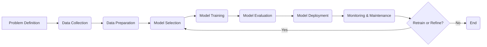

## AI Lifecycle 🔄 - In 5 Minutes

### 🔄 What
*   **End-to-End Process:** The AI lifecycle is an end-to-end process encompassing all stages necessary to develop, deploy, and manage AI solutions.
*   **Iterative and Adaptive:** It emphasizes an iterative approach with ongoing refinement and adaptation to changing requirements and data.
*   **Cross-Disciplinary Collaboration:** Requires collaboration among data scientists, engineers, domain experts, and business stakeholders.
*   **Ethical Considerations:** Incorporates ethical considerations and ensures that AI systems are responsible and unbiased.
*   **Continuous Improvement:** Focuses on continuous monitoring, evaluation, and improvement of AI systems and processes.

### 🎯 Why
*   **Effective AI Project Management:** Provides a structured framework for managing AI projects effectively.
*   **Improved AI System Performance:** Helps ensure that AI systems are well-designed, accurate, and reliable.
*   **Reduced Development Time:** Streamlines the development process, reducing the overall time required to deploy AI solutions.
*   **Responsible AI Development:** Incorporates ethical considerations, ensuring responsible AI development and deployment.
*   **Continuous Value Delivery:** Enables continuous improvement and value delivery through ongoing monitoring and adaptation.

### ⚙️ Where Applied
*   **Smart Cities:** Developing AI-powered solutions for traffic management, resource allocation, and public safety.
*   **Precision Agriculture:** Optimizing crop yields, resource utilization, and pest control.
*   **Personalized Education:** Delivering tailored learning experiences to students.
*   **Supply Chain Optimization:** Enhancing logistics, demand forecasting, and inventory management.
*  **Customer Service:** Building AI-powered chatbots and virtual assistants to improve customer experience.

### 🧠 How it Works
*   **Problem Definition:** Define the problem to be solved using AI and specify the objectives.
*   **Data Acquisition & Preparation:** Gather and prepare relevant data for training and testing.
*   **AI Model Selection:** Choose the appropriate AI model, algorithms, or architecture.
*  **Model Development & Training:** Train AI models using the prepared data and evaluation metrics.
*   **Model Evaluation & Tuning:** Evaluate model performance and make adjustments as needed.
*   **Model Deployment:** Deploy the trained AI model in a production environment.
*   **Monitoring & Maintenance:** Continuously monitor model performance, gather feedback, and make improvements.

### 🔄 Lifecycle
*   **Problem Definition:** Define the problem to be solved by AI.
*   **Data Collection:** Gather data from relevant sources.
*  **Data Preparation:** Prepare data by cleaning, transforming, and engineering it.
*   **Model Selection:** Choose the appropriate AI model and algorithms.
*   **Model Training:** Train the model using the data.
*   **Model Evaluation:** Assess the performance of the model.
*   **Model Deployment:** Deploy the model into the production environment.
*   **Monitoring & Maintenance:** Continuously monitor performance and maintain the system.

### 📊 Diagram

### 🔗 Related Items
*   **Ethical AI:** Developing AI systems that are responsible, fair, and unbiased.
*  **Explainable AI (XAI):** Creating AI systems that are transparent and understandable.
*   **AI Governance:** Establishing policies and procedures to manage AI risk.
*  **AI Infrastructure:** Building the computing resources and data pipelines needed for AI.
*   **AI Testing and Validation:** Validating AI systems before deployment.
