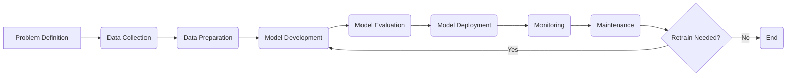

## Machine Learning Lifecycle 🔄 - In 5 Minutes

### 🔄 What
*   **Iterative Process:** The ML lifecycle is an iterative process encompassing all stages required to develop, deploy, and maintain machine learning models.
*   **Structured Approach:** It provides a structured approach to designing, building, and managing ML projects, ensuring they are effective and aligned with business goals.
*   **Cross-Functional Collaboration:** Often involves cross-functional collaboration between data scientists, engineers, and business stakeholders.
*   **Continuous Improvement:** Emphasizes continuous monitoring, evaluation, and improvement of models and processes.
*   **Phased Approach:** Typically involves phases such as problem definition, data collection, modeling, deployment, and monitoring.

### 🎯 Why
*   **Efficient Project Management:** Helps manage ML projects effectively, ensuring timely delivery and optimal results.
*  **Reduced Development Time:** Provides a streamlined process, reducing the overall time it takes to deploy ML models.
*   **Improved Model Performance:** Ensures models are well-tuned, accurate, and reliable.
*   **Effective Deployment:** Ensures smooth and effective deployment of models into production.
*   **Continuous Monitoring & Improvement:** Enables ongoing monitoring and improvement of models to maintain their effectiveness.

### ⚙️ Where Applied
*   **Financial Forecasting:** Developing predictive models for financial markets.
*  **Personalized Recommendations:** Recommending products and services based on user data.
*  **Fraud Detection:** Building systems to detect fraudulent activities in financial transactions.
*   **Healthcare Diagnostics:** Developing models to assist in disease diagnosis.
*   **Autonomous Vehicles:** Implementing AI systems for self-driving cars.

### 🧠 How it Works
*   **Problem Definition:** Define the problem to be solved using ML and set specific objectives.
*   **Data Acquisition:** Collect and curate the required data from various sources.
*   **Data Preprocessing:** Prepare data by cleaning, transforming, and engineering relevant features.
*   **Model Selection:** Choose the right ML model based on the problem type and data.
*   **Model Training:** Train the model on the prepared data using suitable algorithms.
*   **Model Evaluation:** Evaluate model performance on a validation dataset.
*   **Model Tuning:** Fine-tune model hyperparameters to improve accuracy.
*   **Model Deployment:** Deploy the trained model into a production environment.
*  **Monitoring & Maintenance:** Continuously monitor the model and maintain its effectiveness.

### 🔄 Lifecycle
*   **Problem Definition:** Clearly define the business problem and objectives.
*   **Data Collection:** Gather relevant data from various sources.
*  **Data Preparation:** Clean, transform, and prepare data for analysis.
*   **Model Development:** Build and train appropriate machine learning models.
*   **Model Evaluation:** Assess the performance of models using relevant metrics.
*   **Model Deployment:** Deploy the best performing model into production.
*   **Monitoring:** Continuously monitor model performance and data quality.
*   **Maintenance:** Retrain models as needed and make adjustments.

### 📊 Diagram

### 🔗 Related Items
*   **Data Engineering:** Building and maintaining data infrastructure.
*   **Model Evaluation Metrics:** Accuracy, precision, recall, F1-score, etc.
*   **Model Deployment Strategies:** Containerization, serverless deployment, etc.
*  **A/B Testing:** Comparing model performance in real-world settings.
*   **Continuous Integration/Continuous Deployment (CI/CD):** Automating model deployment.
