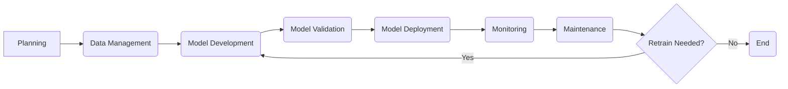

## MLOps ⚙️ - In 5 Minutes

### ⚙️ What
*   **DevOps for ML:** MLOps (Machine Learning Operations) is a set of practices that aims to automate and streamline the machine learning lifecycle.
*   **Bridge Gap:** Bridges the gap between model development and deployment, enabling faster and more reliable delivery of ML applications.
*   **Collaboration:** Emphasizes collaboration between data scientists, software engineers, and operations teams.
*  **Automation:** Focuses on automating various aspects of the ML lifecycle, including data management, model training, and deployment.
*   **Continuous Delivery:** Promotes continuous integration and continuous delivery (CI/CD) for ML models.

### 🎯 Why
*   **Faster Model Deployment:** Streamlines the process of getting ML models into production more quickly.
*   **Increased Reliability:** Ensures models are reliable and perform as expected in real-world environments.
*   **Improved Collaboration:** Enhances collaboration between data science and operations teams.
*   **Reduced Time to Value:** Reduces the time it takes to realize business value from machine learning projects.
*   **Scalability:** Facilitates scaling ML solutions to meet growing demands.

### ⚙️ Where Applied
*   **Financial Services:** Automating fraud detection, credit risk assessment, and algorithmic trading.
*   **E-commerce:** Personalizing product recommendations, optimizing pricing, and managing inventory.
*   **Healthcare:** Improving diagnostic accuracy, drug discovery, and patient care management.
*   **Manufacturing:** Predictive maintenance, quality control, and supply chain optimization.
*  **Autonomous Vehicles:** Developing and deploying AI models for self-driving cars.

### 🧠 How it Works
*   **Data Management:** Automates data collection, validation, and preparation.
*   **Model Training:** Streamlines and automates model training and experimentation.
*   **Model Validation:** Ensures model performance through rigorous testing and validation.
*   **Model Deployment:** Automates deployment of trained models to production.
*  **Monitoring & Feedback:** Continuously monitors model performance and gathers feedback for improvements.

### 🔄 Lifecycle
*  **Planning:** Define project scope, requirements, and infrastructure needs.
*   **Data Management:** Acquire, clean, and prepare the data.
*   **Model Development:** Build, train, and validate ML models.
*   **Deployment:** Deploy models to production environments.
*   **Monitoring:** Continuously monitor model performance and data quality.
*   **Maintenance:** Retrain and update models as needed.

### 📊 Diagram

### 🔗 Related Items
*  **CI/CD for ML:** Automating the deployment pipeline for ML models.
*   **Model Versioning:** Tracking and managing different versions of models.
*   **Automated Model Retraining:** Automating the process of retraining models.
*   **Monitoring Dashboards:** Tracking key metrics for model performance.
*  **Infrastructure as Code (IaC):** Managing infrastructure for ML workloads.
