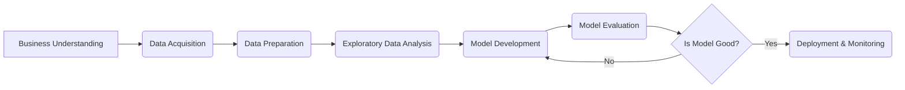

## Data Scientist 🧑‍💻 - In 5 Minutes

### 🧑‍💻 What
*   **Data Analysis & Interpretation:** A Data Scientist is a professional who extracts knowledge and insights from data using various analytical techniques.
*   **Problem Solving:** They tackle complex problems by collecting, processing, and analyzing data to uncover patterns, trends, and actionable insights.
*   **Statistical & ML Expertise:** They possess a strong understanding of statistics, machine learning, and data modeling.
*   **Storytelling with Data:** They communicate findings through visualizations and narratives to inform and persuade stakeholders.
*   **Business Acumen:** Understand business goals and translate them into data-driven solutions.

### 🎯 Why
*   **Data-Driven Decision Making:** Enables businesses and organizations to make informed decisions based on data analysis.
*   **Identifying Trends and Patterns:** Uncovers valuable patterns and trends in data that can drive strategic initiatives.
*   **Process Optimization:** Identifies areas for improvement and optimization based on data analysis.
*   **Predictive Modeling:** Develops predictive models for forecasting and planning.
*   **Innovation:** Drives innovation by uncovering new opportunities and solutions through data analysis.

### ⚙️ Where Applied
*   **E-commerce:** Personalized recommendations, customer segmentation, and fraud detection.
*   **Healthcare:** Predictive diagnostics, drug discovery, and patient care optimization.
*   **Finance:** Risk assessment, algorithmic trading, and fraud prevention.
*   **Marketing:** Campaign optimization, customer behavior analysis, and targeted advertising.
*   **Government:** Policy analysis, public health management, and resource allocation.

### 🧠 How it Works
*   **Data Collection:** Gathering data from various sources.
*   **Data Cleaning & Preprocessing:** Ensuring data quality by cleaning, transforming, and preparing it for analysis.
*   **Data Exploration:** Exploring and analyzing data to identify patterns and insights.
*   **Model Building:** Developing statistical and machine learning models to solve specific problems.
*   **Model Evaluation:** Evaluating model performance and making adjustments.
*  **Visualization & Communication:** Presenting findings to stakeholders using visualizations and reports.

### 🔄 Lifecycle
*   **Business Understanding:** Understand the business requirements and define the problem statement.
*  **Data Acquisition:** Collect data from relevant sources.
*  **Data Preparation:** Clean, transform, and prepare data for analysis.
*   **Exploratory Data Analysis (EDA):** Analyze the data and identify relevant features.
*  **Model Development:** Develop, test, and refine models.
*   **Deployment & Monitoring:** Deploy models and monitor their performance.

### 📊 Diagram

### 🔗 Related Items
*   **Data Mining:** Discovering patterns and knowledge from data.
*   **Machine Learning:** Building and training models using data.
*   **Statistical Analysis:** Analyzing data using statistical techniques.
*   **Data Visualization:** Presenting data using charts and graphs.
*   **Big Data:** Working with large and complex datasets.
