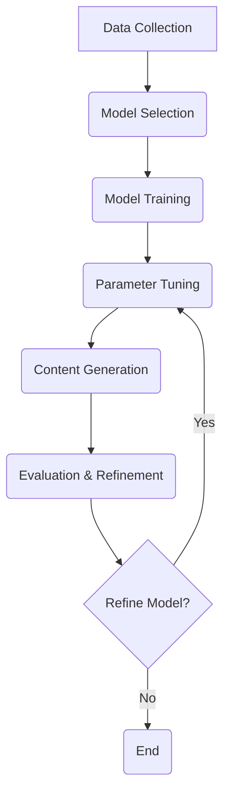

## Generative AI 🎨 - In 5 Minutes

### 🎨 What
*   **Content Creation:** Generative AI is a type of artificial intelligence focused on creating new content, such as text, images, audio, and video.
*   **Learning from Data:** Generative models learn from existing data and then generate new data that has similar patterns.
*   **Variety of Techniques:** Includes techniques like Generative Adversarial Networks (GANs), Variational Autoencoders (VAEs), and Transformer models.
*  **Creative Potential:** Has the ability to create original and unique content, which is different from traditional rule-based systems.
*   **Data Augmentation:** Used for creating synthetic data to augment training datasets for other models.

### 🎯 Why
*   **Automation of Content Creation:** Automates the creation of diverse types of content, saving time and resources.
*   **Creative Exploration:** Enables the exploration of new creative possibilities and outputs that are hard to achieve manually.
*   **Personalization:** Generates personalized content tailored to individual preferences and needs.
*  **Data Synthesis:** Creates synthetic data that is useful for training other machine learning models.
*   **Accelerated Design Processes:** Helps designers explore more options and iterate faster on creative projects.

### ⚙️ Where Applied
*   **Art and Design:** Creating digital art, illustrations, and designs.
*  **Content Creation:** Generating blog posts, articles, and marketing content.
*   **Drug Discovery:** Designing new molecules and drug candidates.
*   **Gaming:** Creating realistic game environments, characters, and storylines.
*   **Music and Audio:** Generating music compositions, sound effects, and audio clips.

### 🧠 How it Works
*   **Training Data:** Models are trained on large amounts of data of the type of content they are meant to generate.
*   **Feature Extraction:** The AI learns patterns and structures within the training data.
*   **Generation Process:** The trained model can generate new data samples by sampling from learned distributions.
*   **Feedback Loop:** Some models, such as GANs, use a feedback loop to iteratively improve the quality of generated content.
*   **Parameter Adjustment:** The models' parameters are adjusted during training to produce realistic results.

### 🔄 Lifecycle
*   **Data Collection:** Gather a large and diverse dataset for training.
*  **Model Selection:** Select a generative model architecture suitable for the task.
*   **Model Training:** Train the model on the collected dataset.
*   **Parameter Tuning:** Optimize model parameters for better generation results.
*   **Content Generation:** Generate new content using the trained model.
*   **Evaluation & Refinement:** Evaluate the quality of generated content and refine model parameters or data as needed.

### 📊 Diagram

### 🔗 Related Items
*  **Generative Adversarial Networks (GANs):** Uses a generator and discriminator network.
*   **Variational Autoencoders (VAEs):** Uses encoders and decoders to generate new content.
*   **Transformer Models:** Highly effective for text and other sequential data generation.
*   **Text-to-Image Models:** Generates images from text descriptions.
*   **Image-to-Image Models:** Transforms one image into another based on training.
