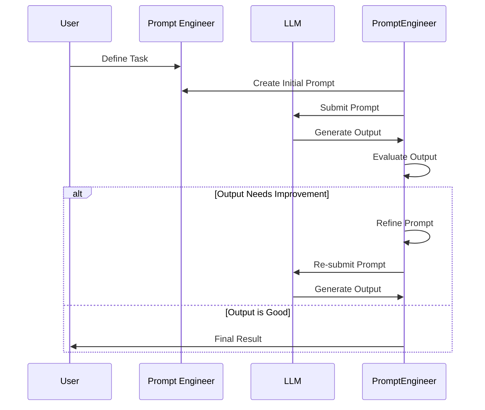

## Prompt Engineering ✍️ - In 5 Minutes

### ✍️ What
*   **Crafting Effective Prompts:** Prompt engineering is the art and science of designing effective prompts to elicit desired responses from large language models (LLMs).
*   **Strategic Input Design:** It involves carefully constructing input text that guides the model towards producing accurate, relevant, and coherent outputs.
*   **Iterative Refinement:** Often requires iterative testing and refinement to optimize prompt effectiveness.
*   **Technique Exploration:** Explores various prompting techniques, including zero-shot, few-shot, and chain-of-thought prompting.
*  **Understanding LLM Behavior:** Requires a deep understanding of how language models interpret prompts and generate responses.

### 🎯 Why
*   **Improved Output Quality:** Well-engineered prompts elicit higher quality and more accurate responses from language models.
*   **Task Optimization:** Allows for more efficient use of LLMs across different tasks, including text generation, summarization, and question-answering.
*   **Cost Reduction:** Optimized prompts reduce the need for multiple interactions, saving time and computational resources.
*  **Control and Customization:** Provides more control over the behavior and output of LLMs.
*   **Problem Solving:** Facilitates the use of LLMs to solve specific problems more effectively.

### ⚙️ Where Applied
*  **Content Generation:** Creating blog posts, articles, and other forms of written content.
*   **Chatbots and Virtual Assistants:** Developing more responsive and helpful conversational agents.
*   **Code Generation:** Generating code snippets and complete programs.
*   **Data Analysis and Extraction:** Extracting insights and patterns from textual data.
*   **Creative Writing:** Generating stories, poems, and other creative outputs.

### 🧠 How it Works
*   **Define the Task:** Clearly identify the task or objective for which you need the language model's response.
*   **Craft a Prompt:** Construct a clear and concise prompt that guides the model towards the desired output.
*   **Prompting Techniques:** Apply techniques like few-shot learning, chain-of-thought, or role-playing in prompts.
*  **Iterate and Refine:** Test the prompt with the language model, evaluate outputs, and refine the prompt for better performance.
*   **Parameter Tuning:** Adjust model parameters, if needed, to enhance the effectiveness of the prompt.

### 🔄 Lifecycle
*  **Problem Identification:** Recognize the task that needs to be accomplished using LLMs.
*   **Prompt Creation:** Write an initial prompt based on the task.
*  **Testing and Evaluation:** Submit the prompt to an LLM and evaluate results.
*   **Prompt Refinement:** Adjust the prompt based on the evaluation results and re-test.
*   **Deployment:** Use the optimized prompt for production.

### 📊 Diagram

### 🔗 Related Items
*   **Zero-Shot Prompting:** Asking a model to perform a task without prior examples.
*   **Few-Shot Prompting:** Providing a few examples in the prompt to guide the model.
*   **Chain-of-Thought Prompting:** Encouraging the model to explain its reasoning step-by-step.
*   **Role-Playing:** Assigning a persona to the language model to guide its behavior.
*  **Prompt Templates:** Reusable prompt structures for common tasks.
