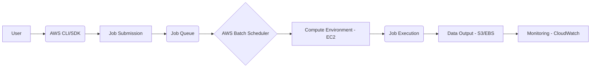

## AWS Batch 📦 - In 5 Minutes

### 📦 What
*   **Managed Batch Processing:** AWS Batch is a fully managed service that allows you to run batch computing workloads on the AWS cloud.
*   **Dynamic Scaling:** It dynamically provisions the optimal quantity and type of compute resources based on your job requirements.
*   **Job Scheduling:** AWS Batch manages the scheduling and execution of your batch jobs without requiring you to install and manage batch processing software.
*  **Container & Non-container Support:** Supports running jobs packaged as Docker containers or as traditional executable scripts.
*   **Integration:** Integrates seamlessly with other AWS services like S3, CloudWatch, and IAM.

### 🎯 Why
*   **Simplified Batch Management:** It reduces the operational burden of managing batch processing infrastructure.
*   **Cost Optimization:** Automatically scales resources based on demand, helping to reduce costs.
*   **Faster Time-to-Results:** Simplifies setting up and running batch jobs, accelerating the overall process.
*   **Scalability:** Easily scales to accommodate larger workloads and fluctuating demand.
*   **Reliability:** Provides a reliable and fault-tolerant environment for running your jobs.

### ⚙️ Where Applied
*   **Financial Modeling:** Running large financial simulations and analysis.
*  **Genomics Research:** Processing genomic data and running bioinformatics analyses.
*  **Image and Video Processing:** Encoding, converting, and processing large volumes of media data.
*   **Scientific Simulations:** Conducting complex scientific calculations and simulations.
*   **Data Transformation:** Performing large-scale data transformation and ETL processes.

### 🧠 How it Works
*   **Job Definition:** You define your jobs by specifying the execution details, including the Docker image, script, and resources required.
*   **Compute Environment:** You set up compute environments, which define the type and number of EC2 instances to use.
*   **Job Queue:** You submit jobs to a queue, and AWS Batch manages their execution according to the queue priority.
*   **Dynamic Provisioning:** AWS Batch automatically provisions and manages the required compute resources, ensuring efficient resource utilization.
*   **Monitoring:** You can monitor job status, resource usage, and logs through AWS Management Console and CloudWatch.

### 🔄 Lifecycle
*   **Job Submission:** Define the job specifications and submit it to the appropriate job queue.
*   **Resource Provisioning:** AWS Batch provisions compute resources, including EC2 instances, based on the job requirements and compute environment settings.
*   **Job Execution:** Jobs are picked up from the queue and executed on the provisioned compute resources.
*   **Monitoring and Logging:** The status, logs, and metrics are available for monitoring through CloudWatch and the AWS console.
*   **Resource Release:** After the job is completed, AWS Batch releases the compute resources to save on costs.

### 📊 Diagram

### 🔗 Related Items
*   **AWS EC2:** The compute instances utilized by AWS Batch.
*   **AWS S3:** Storage for job data and outputs.
*   **AWS CloudWatch:** Monitoring and logging service for AWS Batch.
*   **AWS IAM:** Manages access and permissions for AWS Batch resources.
*   **Docker:** Used for packaging and running jobs in containers.
