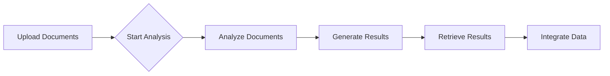

## AWS Textract

**What:**

* **Textract** is an AWS service that automatically extracts text and data from documents such as scanned documents, PDFs, and images. 
* It uses machine learning to accurately identify text, tables, forms, and other key information within documents.

**Why:**

* **Automation:** Automates the time-consuming and error-prone process of manual data entry.
* **Accuracy:** Provides high accuracy in text extraction, minimizing human error.
* **Scalability:** Easily handles large volumes of documents with minimal effort.
* **Cost-effectiveness:** Reduces the need for manual labor, leading to significant cost savings.

**Where Applied:**

* **Invoice Processing:** Extracting invoice data for automated payment processing.
* **Financial Documents:** Analyzing bank statements, insurance claims, and loan applications.
* **Legal Documents:** Processing contracts, legal filings, and discovery documents.
* **Healthcare:** Extracting data from medical records, prescriptions, and insurance forms.

**How to Use:**

1. **Upload Documents:** Upload your documents to the AWS S3 bucket.
2. **Start Analysis:** Initiate a Textract analysis job by specifying the document location and desired output formats (e.g., JSON, HTML).
3. **Retrieve Results:** Access the analysis results, which include extracted text, tables, forms, and other relevant information.
4. **Integrate with Applications:** Integrate the extracted data with your existing applications or workflows.

**Lifecycle:**

1. **Document Upload:** Upload documents to AWS S3.
2. **Analysis Job:** Submit an analysis job to Textract.
3. **Analysis Execution:** Textract analyzes the documents and generates results.
4. **Result Retrieval:** Retrieve analysis results from the specified location.
5. **Data Integration:** Integrate extracted data with downstream applications.

**Diagram (Mermaid.js):**

**Related Services:**

* Amazon Comprehend
* Amazon Rekognition
* Amazon Transcribe
* Amazon Polly
