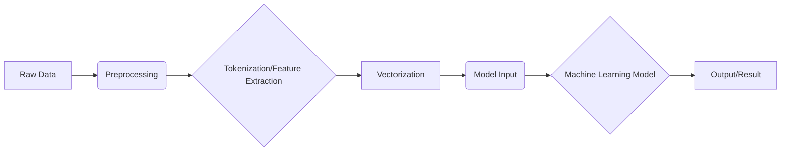

## Vectorization in AI/ML 🧮 - In 5 Minutes

### 🧮 What
*   **Data Transformation:** Vectorization is the process of converting data, whether it's text, images, or other forms, into numerical vectors. These vectors are arrays of numbers that a machine learning model can understand and process.
*   **Feature Representation:** It involves mapping complex data into a lower-dimensional space while retaining important features. This is crucial for machine learning algorithms that require numerical inputs.
*   **Numerical Encoding:** Vectorization essentially encodes data into a format that allows for mathematical operations, making it suitable for various machine learning computations.
*   **Core of ML:** It's a fundamental step in most ML pipelines, converting the raw data into a usable format.
*   **Efficiency:** Vectorization allows for parallel processing, which greatly speeds up computations in ML models.

### 🎯 Why
*   **Model Compatibility:** Machine learning algorithms, especially those based on linear algebra, require numerical data as input. Vectorization makes non-numerical data usable.
*   **Computational Efficiency:** By converting data into vectors, we can leverage efficient matrix and vector operations, resulting in significant speed improvements.
*   **Feature Extraction:** Vectorization helps extract meaningful features from the data, which the model can learn from. This simplifies and enhances the learning process.
*  **Dimensionality Reduction**: Techniques within vectorization like embedding can reduce the complexity of data by transforming it into a space with fewer dimensions.
*   **Standardization:** It provides a standard format for data, making it easier to process diverse types of information within the same machine learning pipeline.

### ⚙️ Where Applied
*   **Natural Language Processing (NLP):** Text data is converted into word or sentence embeddings (vectors) for tasks like sentiment analysis and machine translation.
*   **Image Recognition:** Images are transformed into vectors for input into convolutional neural networks (CNNs).
*   **Recommender Systems:** User and item data are vectorized to determine similarities and make personalized recommendations.
*   **Time Series Analysis:** Time-dependent data is vectorized to identify patterns and make predictions.
*   **Audio Processing:** Sound signals are converted into vectors for speech recognition and audio analysis.

### 🧠 How it Works
*   **Tokenization:** For text, it breaks down the text into smaller units, such as words or characters.
*  **Embedding:** It assigns numerical vectors to these tokens, often using techniques like Word2Vec, GloVe, or BERT embeddings, which capture semantic meanings.
*   **Feature Mapping:** For images, it maps pixels to numerical values, and the process can involve various transformations and feature extraction methods.
*   **Normalization:** To ensure all features are on the same scale, vectors might be normalized.
*   **Vector Space:** These numerical representations are then placed into a vector space where distance, similarity, and other mathematical computations can be made.

### 🔄 Lifecycle
*   **Data Input:** Starts with raw data like text, images, or audio.
*   **Preprocessing:** Clean the data, like removing noise and filling in missing values.
*   **Tokenization/Feature Extraction:** Breaks down the data into basic units or extracts features.
*   **Vectorization:** Converts processed data into numerical vectors.
*   **Model Input:** The vectorized data is then used as input to a machine learning model.

### 📊 Diagram

### 🔗 Related Items
*   **Word Embeddings:** Numerical representations of words.
*  **One-Hot Encoding**: A method to convert categorical data into binary vectors.
*   **TF-IDF:** A technique used in NLP to reflect how important a word is to a document.
